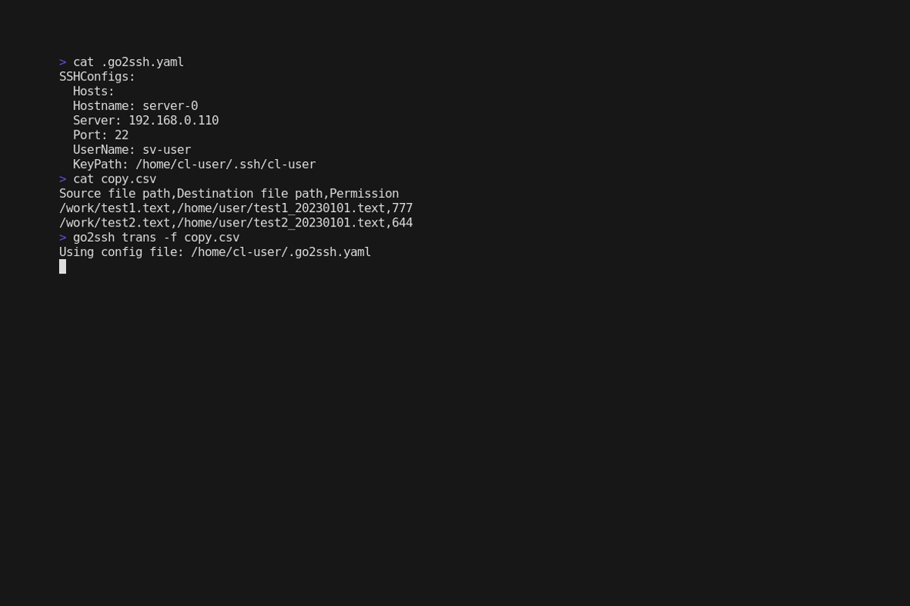

# go2ssh

Use SFTP and SSH protocols to manipulate files to the server.



- [Installation](#Installation)
- [Getting Start](#Getting-Started)
- [Commands](#commands)


## Installation

`go2ssh` is available via our [releases](https://github.com/SoaB1/go2ssh/releases/latest) page as precompiled binaries.
```sh
curl -L https://github.com/SoaB1/go2ssh/releases/latest/download/go2ssh_Linux_x86_64.tar.gz -O
sudo tar -C /usr/local/bin -xzf go2ssh_Linux_x86_64.tar.gz
go2ssh --version
```

## Getting Started

Edit the config file `$HOME/.go2ssh.yaml` or create a new one like the example shown here.
``` sh
SSHConfigs:
  Hostname: hostname
  Server: 192.168.1.1
  Port: 22
  UserName: <username>
  KeyPath: <private-key-path>
```

## Commands
You can use --config in all available commands.

### `trans`
Uploads the specified file in CSV via SFTP protocol.
``` sh
go2ssh trans -f file.csv
```

### `connect`
Connect for a SSH Server.
``` sh
go2ssh connect
```